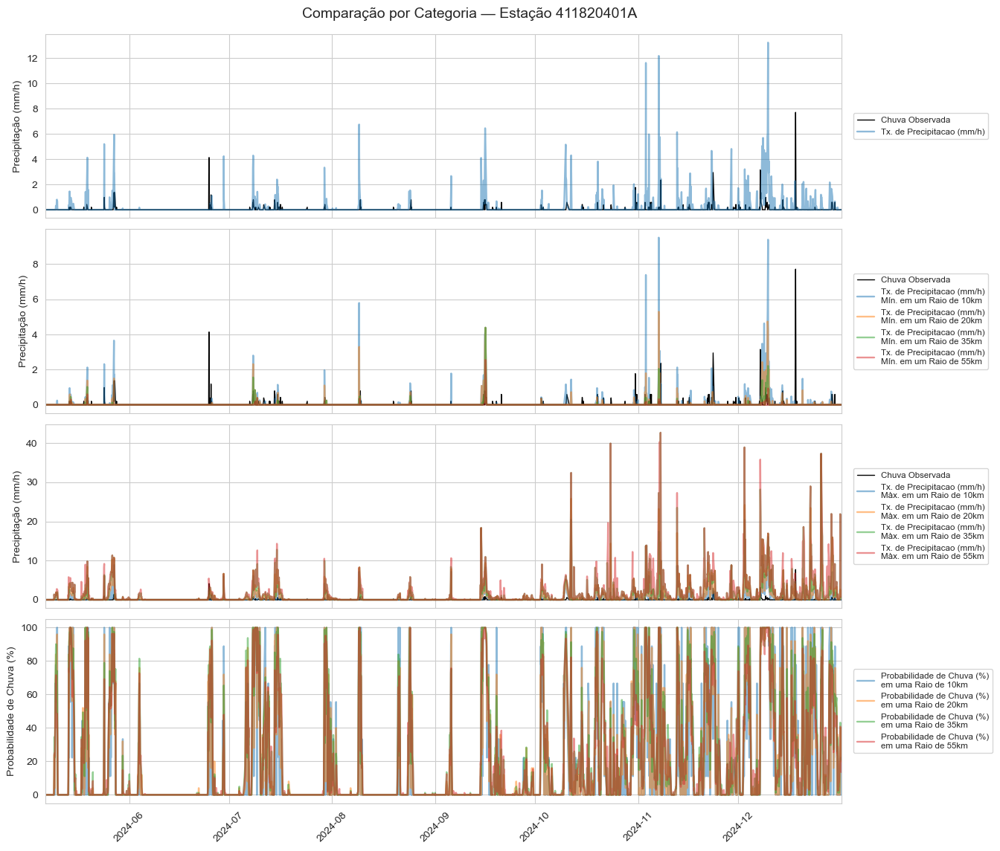
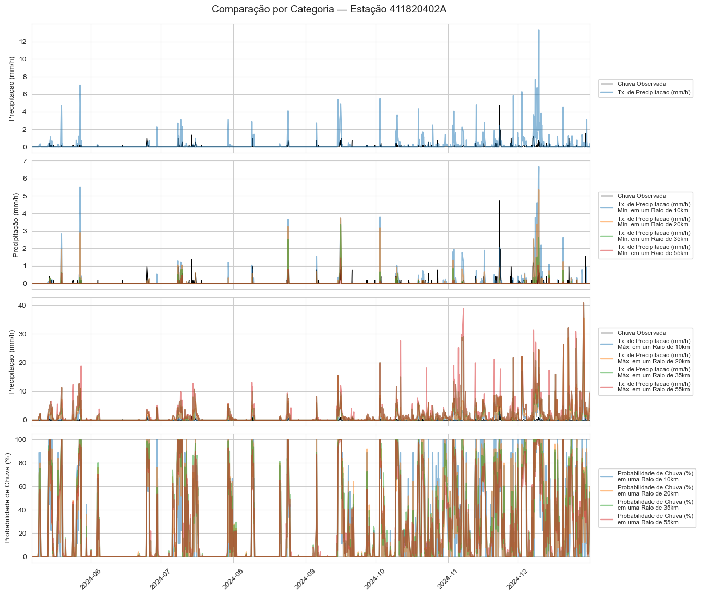
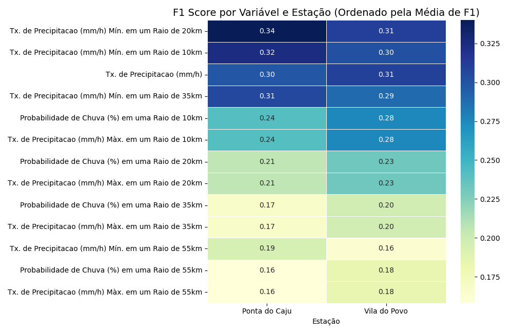
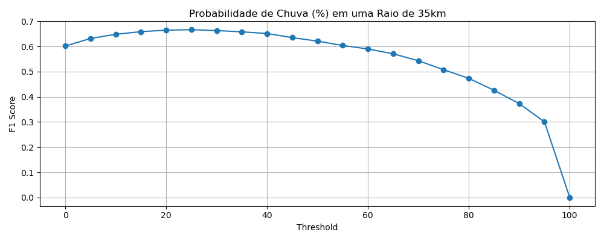
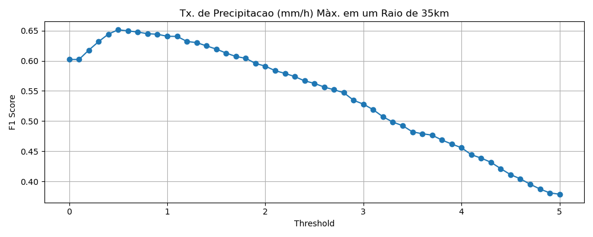
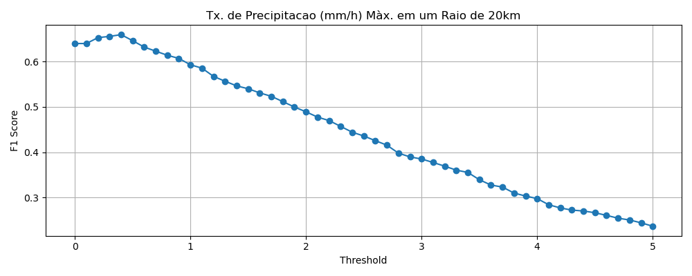
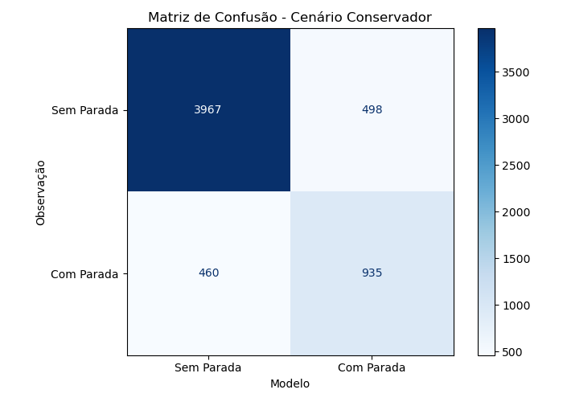
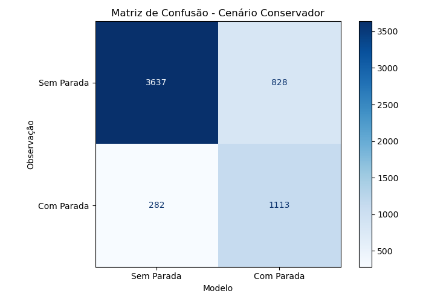
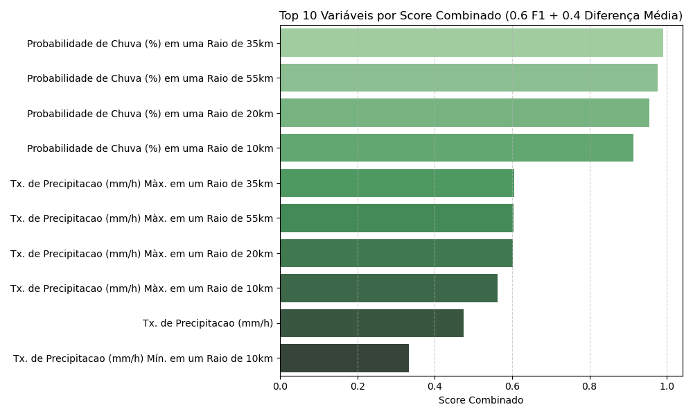

# Desafio_i4Sea

## Objetivo

Este projeto visa identificar a melhor combinação de variáveis de previsão de chuva que maximize a assertividade na tomada de decisão sobre **paradas operacionais no Porto de Paranaguá**. A partir de dados observados (CEMADEN), registros de paradas e previsões meteorológicas, também foram desenvolvidos modelos de decisão simples que permitem responder de forma direta e visual à pergunta do cliente:

> **“Devo ou não operar? Quais as chances de ter que parar minha operação por causa de chuva?”**

---

## O Desafio:
> "Tendo em vista que os clientes utilizam nossas previsões para se planejarem e tomarem melhores decisões operacionais, no seu processo de análise qual seria a melhor combinação de variáveis de previsão que refletisse a melhor assertividade na tomada de decisão desse cliente com relação à ocorrência de chuva?"

---

## Estrutura do Projeto

O repositório está organizado da seguinte forma:

```
Database/              → Dados brutos fornecidos no desafio  
Outputs/               → Figuras, métricas e arquivos gerados pelas análises  
Scripts/               → Notebooks e módulos Python usados nas análises  
    ├── 00_unpack_and_organize.ipynb  
    ├── 01_load_and_merge.ipynb  
    ├── 02_exploratory_analysis.ipynb  
    ├── 03_decision_model.ipynb  
    └── Modules/       → Scripts com funções auxiliares  
```

---

## Tecnologias Utilizadas

- Python 3.10
- Pandas, NumPy
- Matplotlib, Seaborn
- Scikit-learn
- Xarray, netCDF4
- Jupyter Notebook

---

## Como Executar

1. Clone este repositório:
```bash
git clone https://github.com/juliakmansur/Desafio_i4Sea.git
```

2. Instale as dependências (se houver `requirements.txt`):
```bash
pip install -r requirements.txt
```
3. Navegue pelos notebooks na pasta `Scripts/` na ordem numérica:
    - `00_unpack_and_organize.ipynb`
    - `01_load_and_merge.ipynb`
    - `02_exploratory_analysis.ipynb`
    - `03_decision_model.ipynb`

---

## Análises Realizadas

### 1. Comparação entre Modelo de Previsão e Chuvas Observadas (CEMADEN)
Inicialmente, foi realizada uma comparação entre os dados de previsão e os registros observados de precipitação provenientes das estações CEMADEN próximas ao Porto de Paranaguá.




> ⚠️ A estação Padre Jackson foi descartada por ausência significativa de dados.

A avaliação mostrou melhor representatividade espacial nas variáveis de **Tx. de Precipitação Min.** com destaque para aquelas com raio de abrangência de 20 a 10km.



---

### 2. Avaliação de Variáveis com Base nas Ocorrências de Parada
Foram analisados os eventos de parada por chuva registrados em 2024 e seu cruzamento com os dados de previsão. Buscou-se:

- Identificar **quais variáveis são mais eficazes em prever dias com parada**;
- Determinar **limiar/thresholds ideais** por variável (maximizando F1, precision, recall).

Exemplos de curvas F1 Score:








---

### 3. Construção de Cenários de Decisão
Com base nos thresholds, foram gerados dois modelos de decisão binária:

#### 🔹 Modelo 1 – baseado em métricas:
- **Conservador** → prioriza **Recall**
- **Moderado** → prioriza **F1 Score**
- **Arrojado** → prioriza **Precisão**



#### 🔸 Modelo 2 – baseado em análise estatística + métrica combinada
- Combina **diferença de média entre classes** e **F1 Score** por variável



---

## Resultados

A análise mostrou que as variáveis mais eficazes na previsão de paradas por chuva são:

1. **precipitation_probability_35km**
2. **precipitation_probability_55km**
3. **precipitation_probability_20km**

Essas variáveis lideraram o **ranking combinado de estatística + desempenho preditivo**:



Além disso, variáveis de precipitação máxima (`lwe_precipitation_maximum_35km` e `20km`) foram integradas como **filtros adicionais**, reforçando a intensidade da precipitação no processo decisório.

A lógica de decisão final adotou a regra **"OR" entre condições**:
> A operação é interrompida se **qualquer uma das variáveis-chave ultrapassar o threshold estabelecido**.

Esse modelo de decisão possibilitou a construção de três cenários adaptáveis ao apetite ao risco operacional:

| Cenário       | Características                                                   |
|---------------|--------------------------------------------------------------------|
| 🔵 Conservador | Indica mais paradas, priorizando segurança                         |
| 🟡 Moderado    | Equilíbrio entre produtividade e segurança                         |
| 🔴 Arrojado    | Indica menos paradas, tolerando mais risco                         |

Modelos de classificação supervisionada — **Random Forest** e **Regressão Logística** — foram aplicados como forma complementar de análise. Embora os resultados obtidos ainda não tenham atingido o desempenho ideal (sugerindo a necessidade de um treinamento mais robusto e ajuste de hiperparâmetros), eles serviram como **instrumento exploratório adicional** para reforçar a importância das variáveis selecionadas nos cenários construídos.

Esses modelos ajudaram a validar, de forma preliminar, que as variáveis identificadas como relevantes estão alinhadas com o comportamento observado nos dados históricos de paradas por chuva.

---

## Conclusão

- A melhor combinação de variáveis para prever paradas por chuva envolve **probabilidade de precipitação em diferentes escalas espaciais**, especialmente:
  - `precipitation_probability_35km`
  - `precipitation_probability_55km`
  - `precipitation_probability_20km`

- Essas variáveis devem ser **ajustadas por thresholds** conforme o **cenário desejado**.
- O cliente, mesmo leigo, pode se beneficiar de um sistema que responde: **“Devo ou não operar?”**, com base em cenários visuais e métricas claras.

> Resultado: Dados transformados em poder de decisão para o cliente.
